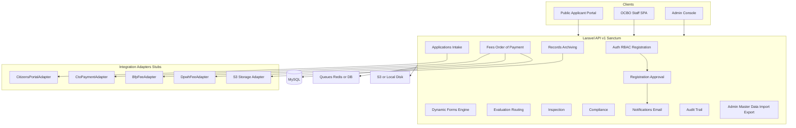
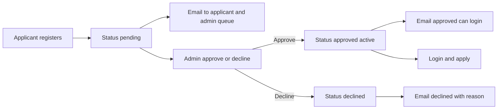
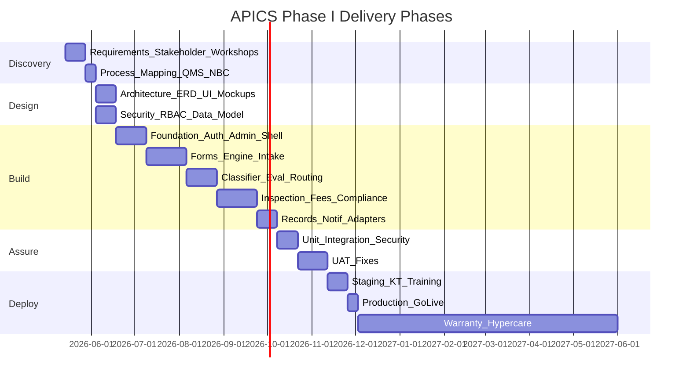

# APICS Phase I — Project Plan (CSFP / OCBO)

## Confirmed decisions

- **Scope:** Full Phase I (1A) — Application/Intake, Unified Forms, Permit Classifier, Evaluation/Routing, Inspection, basic Order of Payment/fees, Compliance Notices, Records/Archiving, Notifications.
- **Integrations:** API-ready **stubs/adapters** for Citizens Portal, CTO, BFP/DPWH fee hooks (live wiring later).
- **Stack (this repo):** Laravel 12 + Sanctum + MySQL + Vite + TypeScript + Tailwind — **not** CodeIgniter 4 + JWT from the TOR. Same intent (API-capable + token auth); document the mapping in technical docs for BAC/ICT acceptance.
- **Admin principle:** All operational and reference data is **CRUD + import/export** from Admin (no hard-coded business lists).
- **Plan sync (mandatory):** Every time a function/feature is **done**, update this project plan before telling the user it is done (Cursor rule + process gate).
- **Applicant registration (mandatory):** Citizens/applicants may **self-register**. Accounts stay **pending** until an Admin **approves** or **declines**. Emails notify the registrant (and admins as needed) on submit / approve / decline. **Only approved** applicants may log in and file applications. Staff/admin accounts are **not** open self-signup (Admin-created only). Citizens Portal SSO remains a later link option on top of this.
- **UI design template (mandatory):** All screens use the **Velzon** theme in [`public/master/`](public/master/) (rule: `.cursor/rules/velzon-master-design-template.mdc`). Match demo HTML structure/assets; brand as APICS/CSFP; keep Axios SPA behavior.

---

## 1. Project identity & deliverables (TOR-aligned)

| TOR deliverable | Plan artifact |
|-----------------|---------------|
| APICS Phase I | Production-ready web system (public + OCBO staff + Admin) |
| Source code | This repository (CGSFP ownership) |
| Project Documentation | `docs/` suite (see §8) |
| User’s Manual | Public + Staff + Admin manuals |
| ICT Knowledge Transfer | Runbooks + KT sessions |
| End-user Training | Training plan + scripts |
| 6-month warranty | Support SLA process + issue tracker conventions |

**Legal / ops notes to document:** QMS alignment, P.D. 1096, RA 11032, JMC 2018-01; confidentiality/NDA; data sovereignty (CGSFP owns code/data); 24h support within warranty year per TOR.

---

## 2. Target architecture

**Patterns (project rules):** thin API controllers → Services → Repositories; FormRequests; JsonResources; `{ status, message, data|errors }`; Axios SPA modules; mandatory `AuditLogger` on mutations; Tailwind-only UI; device matrix QA.

---

## 3. Personas & access

| Persona | Capabilities |
|---------|----------------|
| **Applicant (Citizen)** | **Self-register** → wait for Admin decision → on **approval**, login and apply; upload docs; track status; receive email notices; download releases. Declined users cannot log in. |
| **Receiving / Front desk** | Intake, completeness check, classify Simple/Complex/Highly Technical |
| **Evaluator / Technical staff** | Routing slips, evaluation sheets, findings, time tracking |
| **Inspector** | Joint scheduling, notes, compliance sheets, final electrical inspection forms |
| **Assessor / Cashier (Phase I basic)** | Generate Order of Payment, fee breakdown by LGU/BFP/DPWH (CTO stub) |
| **Compliance officer** | G-03 / G-04 notices, re-evaluation / appeal support |
| **Records / Archivist** | Releasing logbook, endorsement logs, backups/CICTO logs metadata |
| **Admin / ICT** | Approve/decline **registration queue**; full master-data CRUD, import/export, users/roles, workflows, templates, audit viewer, system settings; create staff accounts (no public staff signup) |
| **Building Official / Approver** | Approvals, final certificates release gates |

RBAC via Spatie permissions — assignable in Admin (**Users & Roles** at `/admin/users`). Applicant signup remains via **Registrations** queue.

### 3.1 Registration approval flow

**Rules**
- Registration fields (minimum): name, email, phone, password (strong rules), optional address/ID meta (Admin-extensible later).
- `registration_status`: `pending` | `approved` | `declined`.
- Login **blocked** unless `approved` + `is_active`.
- Decline requires a reason (stored + emailed; audited).
- Emails: `registration.submitted` (to applicant + notify admins), `registration.approved`, `registration.declined`.
- Audit events: `user.registered`, `user.registration_approved`, `user.registration_declined`.
- Rate-limit register endpoint; never reveal whether an email exists beyond safe messaging.
- Staff/admin: created only in Admin Users module (separate from public register).

---

## 4. Phase I functional modules

### 4.0 Account registration & approval (DONE)
- Public `/register` UI + `POST /api/v1/auth/register`.
- Admin Registrations queue UI (`/admin/registrations`) + APIs: list pending, approve, decline (with reason).
- Email notifications (Mailables; `MAIL_*` / log driver in local): received, admin alert, approved, declined.
- Login blocked until approved; seeded demo applicant remains pre-approved for testing.

### 4.1 Application & Intake
- Requires **approved** applicant account (or future Citizens Portal–linked approved identity).
- Online application wizard tied to **dynamic form definitions** (not hard-coded fields).
- Document checklist & uploads (MIME/size validation; S3 adapter with local fallback).
- Application number generation (Admin-configurable series).
- Citizens Portal adapter: create/link citizen profile stub + webhook placeholders.
- Status timeline for applicant.

### 4.2 Unified Forms (QMS-36, QMS-37 + extensible)
- Form catalog in Admin: code, revision, effective date, PDF/print template, field schema (JSON), required attachments.
- Seed official forms; Admin can edit/version all ~40+ form types over time (building/ancillary/accessory, occupancy, CFEI, completion, routing slips).
- Generate filled PDF/print views from application data.

### 4.3 Permit Classifier
- Rules engine (Admin-editable): Simple / Complex / Highly Technical.
- Affects SLA clocks and routing templates.

### 4.4 Evaluation & Routing
- Dynamic routing slip generation (QMS-61/62 templates).
- Evaluation sheets & technical findings (QMS-63/64).
- Per-department / per-staff time tracking (start/stop + auto-audit).
- Configurable workflow states & transitions in Admin.

### 4.5 Inspection Management
- Joint inspection scheduling (QMS-38/39).
- Individual inspector notes (O-03).
- Inspection logs & compliance sheets (QMS-65).
- Final electrical inspection (DPWH Form 77-006-E) as templated form instance.
- Calendar UI + conflict checks; mobile-friendly capture.

### 4.6 Payment & Assessment (Phase I — basic; CTO deep integration = Phase II)
- Unified Order of Payment (G-02).
- Fee schedule tables (Admin CRUD + import): LGU / BFP / DPWH breakdown.
- Assessment computation from fee rules; override with reason + audit.
- CTO adapter stub: “post assessment / payment status” interfaces only.

### 4.7 Compliance Monitoring
- Notices of Compliance (G-03) and Disapproval (G-04) — templated, editable content blocks.
- Re-evaluation & appeal workflow support.
- Link notices to application & inspection findings.

### 4.8 Records & Archiving
- Releasing logbook (G-01, O-02, E-series).
- Backup & CICTO logs (G-05), Endorsement logs (G-06).
- Document retention metadata; export packages; soft-delete with audit.

### 4.9 Notifications & Status Updates
- In-app + email (SMS adapter stub optional).
- **Registration emails:** submitted (pending), approved, declined (with reason).
- Event-driven: submitted, for evaluation, for inspection, for payment, released, disapproved.
- Templates editable in Admin.

### 4.10 Audit trail (TOR mandatory)
- Log view/save/edit/delete and auth events via `App\Services\Audit\AuditLogger`.
- Admin audit module at `/modules/audit` (filter by actor, event, date, resource).

---

## 5. Admin master data (fillable / editable / importable)

Everything business-facing is Admin-managed. Each entity: DataTable list, modal CRUD, CSV/XLSX import with validation report, CSV export, soft-delete where safe.

**Core admin domains**

| Domain | Examples |
|--------|----------|
| Organization | Departments, offices, signatories, inspector pools |
| Users & Access | Users, roles, permissions, device sessions, **registration approval queue** |
| Reference | Barangays, occupancy types, building types, project natures, zones |
| Forms | Form definitions, field schemas, revisions, print templates |
| Workflow | Statuses, transitions, routing templates, SLA clocks, classifiers |
| Fees | Fee schedules, formula components, agency splits (LGU/BFP/DPWH) |
| Documents | Checklist templates, allowed MIME/size, retention |
| Notices | G-03/G-04 templates, letterheads, numbering series |
| Notifications | Email/SMS templates, triggers (**incl. registration approve/decline**) |
| Integrations | Adapter endpoints, API keys (encrypted), enable/disable stubs |
| System | Holidays (SLA), numbering series, branding, feature flags |

**Import rules:** dry-run → error report → commit; UUID keys; never overwrite without confirmation; all imports audited.

---

## 6. Implementation phases (methodology → delivery)

Aligns to TOR methodology + agile sprints. Estimate assumes one full-stack team; adjust calendar later.

### Phase 0 — Project setup (week 0–1)
- Env, CI, Sanctum, roles, audit base, design system, `docs/` skeleton.
- Admin shell + reusable Blade/JS components (button, modal, table, form).

### Phase 1 — Discovery & design (weeks 1–5)
- Stakeholder interviews (engineers, applicants, inspectors, admin).
- Map AS-IS vs TO-BE flows; bottleneck list.
- ERD, API map, UI mockups (public/staff/admin), threat model.
- **Docs:** Project Charter, Process Flow, Phase Plan, Data Dictionary draft.

### Phase 2 — Foundation (weeks 5–8)
- Auth (Sanctum), RBAC, audit, file storage adapter, API envelope, DataTables patterns.
- Admin CRUD scaffolding + import/export framework.
- Seed departments, roles, sample barangays.

### Phase 3 — Intake & Forms Engine (weeks 8–12)
- Dynamic forms + online application + uploads + tracking.
- Citizens Portal adapter stub.
- Admin: forms, checklists, numbering, reference data.

### Phase 4 — Classifier, Evaluation, Routing (weeks 12–15)
- Classification rules; routing slips; evaluation sheets; time tracking.
- Admin: workflows, SLA, routing templates.

### Phase 5 — Inspection, Fees, Compliance (weeks 15–19)
- Scheduling, notes, compliance sheets, electrical form.
- Order of Payment + fee engine + CTO/BFP/DPWH stubs.
- G-03/G-04 notices + appeals support.

### Phase 6 — Records, Notifications, Polish (weeks 19–21)
- Logbooks G-01/O-02/E-series, G-05/G-06.
- Notification engine; dashboards; print/PDF; responsive pass (device matrix).

### Phase 7 — QA, UAT, Deploy (weeks 21–27)
- Unit/feature/API tests; integration & stress; security review; UAT scripts.
- Staging → training → production; Certificate of Acceptance checklist.
- Handover: source, docs, manuals, KT for CICTO.

### Phase 8 — Warranty (6 months post-acceptance)
- Bugfix SLA (24h response per TOR); patches; feedback loop.

**Out of Phase I (roadmap):** Phase II detailed CTO live payment integration; Phase III (as TOR clarifies) — keep stubs and interface contracts ready.

---

## 7. Key technical workstreams (repo layout)

New modules follow project convention:

- `app/Services/{Module}/...`
- `app/Repositories/{Module}/...`
- `app/Http/Controllers/API/...`
- `resources/js/modules/{module-name}/...`
- `docs/` for all project documentation

**Priority foundational packages/features:** Laravel Sanctum, Spatie Permission (or equivalent), Excel import (e.g. Maatwebsite), PDF generation, queue workers, AWS S3 disk, activity/audit tables.

**Security gates:** FormRequest everywhere; Policies; rate limits on auth; no `$guarded = []`; encrypted integration secrets; IDOR checks; CSP/headers; PH data privacy notes in docs.

---

## 8. Documentation set to create (professional)

Create under [`docs/`](docs/):

| Document | Purpose |
|----------|---------|
| `docs/00-project-charter.md` | Goals, stakeholders, scope, success criteria, TOR mapping |
| `docs/01-phases-and-methodology.md` | Phases 0–8, sprint map, RACI |
| `docs/02-system-architecture.md` | Stack, diagrams, adapters, hosting |
| `docs/03-process-flows.md` | End-to-end Mermaid/BPMN-style flows (apply → evaluate → inspect → pay → release) |
| `docs/04-module-specifications.md` | Per-module functional specs & form codes |
| `docs/05-data-model-and-admin-catalog.md` | Entities + **all Admin-editable datasets** + import formats |
| `docs/06-api-specification.md` | `/api/v1` resources, auth, envelopes (OpenAPI later) |
| `docs/07-security-and-audit.md` | Threat model, RBAC, audit events |
| `docs/08-integrations-adapters.md` | Citizens/CTO/BFP/DPWH stub contracts |
| `docs/09-uat-test-plan.md` | Cases, device matrix, stress criteria |
| `docs/10-deployment-runbook.md` | Staging/prod, storage:link, queues, S3 |
| `docs/11-user-manual-outline.md` | Public / Staff / Admin manuals structure |
| `docs/12-training-and-kt-plan.md` | End-user + ICT KT agenda |
| `docs/13-roadmap-phase-ii-iii.md` | CTO live + future phases |
| `docs/14-warranty-and-sla.md` | 6-month warranty + 24h support process |
| `README.md` | Update with APICS overview + link to `docs/` |

---

## 9. Professional UI/UX surfaces

- **Public:** branded CSFP/OCBO portal — modern, trustworthy LGU aesthetic (slate/neutral + institutional accents), mobile-first, dark mode optional.
- **Staff:** dense but clean work queues, context menus on DataTables, skeleton loaders, SLA badges.
- **Admin:** master-data console with import wizards, audit viewer, system health.
- Enforce PCSPC + device matrix (320→1920+, Apple Safari) before any UI “done”.

---

## 10. Testing & acceptance

- PHPUnit/feature tests for critical APIs and fee/workflow rules.
- Negative paths: unauthorized, invalid import, incomplete applications.
- Integration tests against adapter stubs.
- UAT with OCBO personas; signed UAT sheets.
- Acceptance = TOR deliverables checklist + Certificate of Inspection and Acceptance.

---

## 11. Plan sync rule (update project plan on every done)

**Non-negotiable process:** After completing any function, feature, module slice, bugfix, or docs deliverable — and **before** saying **done** to the user — update the living project plan.

### Cursor rule to add (on execution)

Create [`.cursor/rules/update-project-plan-on-done.mdc`](.cursor/rules/update-project-plan-on-done.mdc) with `alwaysApply: true`:

- When a unit of work is finished, update the APICS project plan file (and linked `docs/` status where relevant).
- Mark matching todos `completed` / add new todos if scope grew.
- Append a short **Progress changelog** entry: date, what shipped, what’s next, blockers.
- Do not claim done if the plan was not updated.
- Applies together with `senior-multi-role-gate.mdc` (QA/security/device checks still required).

### What to update in the plan each time

- Frontmatter `todos` statuses
- Progress changelog section (below)
- Module/phase completion notes if a Phase I slice finished
- Risks/blockers if anything slipped

### Progress changelog

| Date | Completed | Notes / next |
|------|-----------|--------------|
| 2026-09-17 | Plan-sync Cursor rule + CLAUDE.md | Rule alwaysApply |
| 2026-09-17 | Full `docs/` suite (00–14) + README | Professional project documentation |
| 2026-09-17 | Foundation: Sanctum, Spatie RBAC, AuditLogger, API envelope, Admin UI shell, departments CRUD/import/export, forms CRUD, audit viewer | Seeded admin/applicant; 3 feature tests passing |
| 2026-09-17 | Forms + Intake vertical slice: draft/submit applications, QMS-36/37 seeds, Citizens Portal stub | Uploads / richer wizard still next |
| 2026-09-17 | **Plan updated:** applicant self-registration + Admin approve/decline + email notices | Next implement `registration-approval` todo |
| 2026-09-17 | **Rule added:** Velzon `public/master` is mandatory UI design template for entire project | Migrate Blade layouts to Velzon shells |
| 2026-09-17 | **UI converted:** all done pages to Velzon (landing, auth, app shell, admin lists) | Registration approval next (Velzon signup + queue) |
| 2026-09-17 | **Reverted `/` home** off Velzon landing — restored custom APICS product landing (`layouts.app`) | Auth/admin remain on Velzon |
| 2026-09-17 | **Home converted to Velzon landing shell** with full APICS content (hero, capabilities, showcase, workflow, access, mandate, CTA) | Registration approval next |
| 2026-09-17 | **Admin dashboard Project Plan tracker** (`config/apics_project_plan.php` + progress UI + `GET /api/v1/admin/project-plan`) | Keep config in sync when marking todos done; next = registration approval |
| 2026-09-17 | **Registration approval shipped:** `/register`, `/admin/registrations`, emails (received/admin/approved/declined), login blocked until approved; 3 feature tests | Next: classifier/eval or document uploads |
| 2026-09-17 | **Admin Project Plan tracker now reads this markdown** (`.cursor/plans/apics_phase_i_plan_5d06a183.plan.md` frontmatter todos) as single source of truth | Edit this file to update `/admin` progress; stub plan synced |
| 2026-09-17 | **Admin dashboard shows all delivery Phases 0–8** (+ Phase II/III roadmap) parsed from §6 of this plan | Progress % is phases completed / 9 |
| 2026-09-17 | **QA fix:** role-aware Velzon sidebar/topbar + working Sign out (revoke Sanctum token, clear local session); admin pages guarded client-side | Re-login once if old session lacked `apics_user` |
| 2026-09-17 | **Full table seeders** (roles, depts, 11 demo personas + pending applicant, forms, series, apps/docs, audit) + **quick login** buttons on `/login` | 10 clickable demo accounts in local |
| 2026-09-17 | **Phase 4 shipped:** classification rules, routing templates/slips, evaluation sheets, time tracking, staff evaluation queue UI + APIs | Next: Phase 5 inspection/fees/compliance |
| 2026-09-17 | **Global DataTable standard:** Cursor rule + `createApicsDataTable` (search/filters/export/colvis/responsive/sticky Actions/right-click); migrated departments, forms, audit, registrations, classifier, routing, evaluation queue, applications | Next: Phase 5 inspection/fees/compliance |
| 2026-09-17 | **Phase 5 shipped:** inspections schedule/complete, fee rules + G-02 OoP (CTO/BFP/DPWH stubs), G-03/G-04 notices + appeals; Velzon DataTables UI; feature tests green | Next: Phase 6 records/notifications |
| 2026-09-17 | **Privilege-aware sidebar/topbar:** hide nav items without Spatie permissions (`data-nav-permissions`); redirect unauthorized admin page access | Next: Phase 6 records/notifications |
| 2026-09-17 | **Phase 6 shipped:** G-01/O-02/E/G-05/G-06 logbooks + print, archives (CICTO checksum stub), notification templates/inbox/email, dashboard KPIs; Velzon DataTables; feature tests green | Next: Phase 7 QA/UAT/deploy |
| 2026-09-17 | **QA gate shipped:** 24 PHPUnit tests (incl. `SecurityHardeningTest`); remediations (signed logbook print, demo-login API, Sanctum TTL, generic login errors); `docs/15-security-review-phase-i.md`; UAT plan + scenarios + `scripts/uat-api-smoke.sh` (smoke passed locally) | Remaining: staging → KT → production go-live |
| 2026-09-17 | **Users & Roles admin shipped:** `/admin/users` DataTable + `/api/v1/admin/users` CRUD/meta; staff create, role assign, activate/deactivate; last-admin & self-deactivate guards; feature tests | Remaining Phase 7: staging → KT → production |
| 2026-09-17 | **Applicant `/applications` portal polish:** welcome banner, KPI cards, auth gate, new/edit draft modal, view details, richer status badges + DataTable actions | Remaining: staging → KT → production |
| 2026-09-17 | **Shell fix:** collapsed sidebar no longer bleeds “APICS” into page title (removed Bootstrap display utils on `.logo-lg`/`.logo-sm`; `apics-shell.css` + hamburger hit-area polish) | Remaining: staging → KT → production |
| 2026-09-17 | **Application picker:** searchable dropdown (`<x-forms.application-select>`) on Inspections, OoP, Compliance, Logbooks, Archives; `GET /api/v1/staff/applications/lookup` | Remaining: staging → KT → production |
| 2026-09-17 | **Landing polish (gov-grade):** seal+wordmark hero, admin-chrome preview (not mock float), 2 CTAs, mandate under hero, shared `apics-status` tokens, distinct step CTAs, footer TOR/acceptance line | Remaining: staging → KT → production |
| 2026-09-17 | **DataTables Export menu:** solid background for Export/Columns collections (all tables); Copy success uses toast instead of centered overlay | Remaining: staging → KT → production |
| 2026-09-17 | **Landing motion (restrained):** scroll reveals + stagger, nav shrink/shadow, hero wave parallax, pipeline highlight + count-up, card lift / arrow nudge / btn active; `prefers-reduced-motion` + progressive enhancement | Remaining: staging → KT → production |
| 2026-09-17 | **Operations sequential gates:** Eval → Inspect → OoP → Compliance; API blocks skip; lookup `for_step` filters pickers; action success toasts + auto-navigate to next step; mark-paid → released | Remaining: staging → KT → production |
| 2026-09-17 | **Seeders refreshed for ops pipeline:** apps at draft/submitted/under_eval/for_inspection/for_payment/for_compliance/released + `OperationsDemoSeeder` (evals, inspections, OoP, G-03); `migrate:fresh --seed` OK | Remaining: staging → KT → production |
| 2026-09-17 | **Role-scoped Operations:** inspector → Inspections home; eval/inspect/fees/compliance permissions; other steps locked; cross-role handoff toast (no redirect) | Remaining: staging → KT → production |
| 2026-09-17 | **Full privilege audit:** `records.manage` for logbooks/archives; always refresh `/me` perms; `PrivilegeMatrixTest` covers all demo roles (allow/deny + redirects) | Remaining: staging → KT → production |
| 2026-09-17 | **Applicant form areas:** Lot area + Floor area (+ owner/occupancy) on `/applications` draft modal; QMS-36 schema updated; fees still prefer `lot_area` then `floor_area` | Remaining: staging → KT → production |
| 2026-09-17 | **Complete QMS-36/37 fields:** FieldCatalog (owner/property/building/professionals) + dynamic applicant form renderer; attachment checklists; seeded rich payloads | Remaining: staging → KT → production |
| 2026-09-17 | **Form builder on `/admin/forms`:** section/field editor (add/reorder/remove), QMS-36/37 templates API, schema validation, Edit/Toggle/Delete DataTable actions; `FormDefinitionBuilderTest` green | Remaining: staging → KT → production |
| 2026-09-17 | **Modal scroll fix:** fixed header/footer + scrollable body (`apics-modal.css`) for `/applications` form/view + form builder/users | Remaining: staging → KT → production |
| 2026-09-17 | **Application document uploads:** `/admin/forms` attachment keys → upload slots on `/applications`; private storage; replace/delete; submit blocks until required files uploaded; feature tests green | Remaining: staging → KT → production |
| 2026-09-17 | **Ops pages detailed view:** richer process-flow step copy + “Now on Step n” panel; shared View details modal (payload sections, docs, routing) on Eval/Inspect/Pay/Compliance; `GET /api/v1/staff/applications/{uuid}` | Remaining: staging → KT → production |
| 2026-09-17 | **Document PDF/image viewer:** authenticated stream `…/documents/{uuid}/file`; View opens inline PDF iframe / image preview + download (ops details + applicant uploads) | Remaining: staging → KT → production |
| 2026-09-17 | **Document viewer UX:** replaced stacked modal with full-screen lightbox (Back/Esc, slim bar, max canvas); cleaner file names in lists | Remaining: staging → KT → production |
| 2026-09-17 | **Orders of Payment polish:** KPI summary cards, fee preview before issue, detailed OoP modal (app + line items + payment trail), richer DataTable; preview API + list `summary` | Remaining: staging → KT → production |
| 2026-09-17 | **Compliance / Logbooks / Archives polish:** KPI cards, detail modals (notice body + appeals resolve, logbook print, archive checksum/meta), status/media filters, list `summary` APIs | Remaining: staging → KT → production |
| 2026-09-17 | **Workflow config polish:** classification rules, fee rules, routing templates — KPI cards, detail modals, fixed Complex filter, toggle active (classifier), list `summary` APIs | Remaining: staging → KT → production |
| 2026-09-17 | **Ops completed accordion:** Evaluation Queue, Inspections, Orders of Payment, Compliance Notices — active table + collapsed Velzon accordion for completed history; API `bucket=active\|completed`; shared `<x-ops.completed-accordion>` | Remaining: staging → KT → production |
| 2026-09-17 | **Workflow config Edit:** classification rules, fee rules, routing templates — dual-mode create/edit modals + row Edit; fee/routing `PUT` APIs + FormRequests + audit; feature tests green | Remaining: staging → KT → production |
| 2026-09-17 | **Ops routing visibility:** process-flow “View routing templates” browse modal + staff read-only API; slip shows source template; Manage link for `workflow.manage` | Remaining: staging → KT → production |
| 2026-09-17 | **MapLibre location pickers:** reusable search+pin map (OpenFreeMap + Nominatim proxy); project location, inspection location, form `location` fields; lat/lng columns; geo API tests | Re-seed forms to refresh QMS-36 location field types; remaining: staging → KT → production |
| 2026-09-17 | **Toast readability:** larger APICS toast (font ~0.975rem, icon 1.75rem, padding, max-width 28rem) so success/error notices are easy to read | Remaining: staging → KT → production |
| 2026-09-17 | **Sidebar UX polish:** ops uses outline icons (no numbered rail/caption); active pill + left accent; consistent section dividers; brighter titles; larger brand lockup | Remaining: staging → KT → production |
| 2026-09-17 | **Sidebar polish v2:** fix duplicate brand (logo-dark/light); Option A floating active pill; inset section dividers; wider title tracking; live queue badges (registrations / eval / compliance) | Remaining: staging → KT → production |
| 2026-09-17 | **Sidebar polish v3:** solid high-contrast badges; capsule active inset (mx-3); remove section dividers; tighter 10px category tracking | Remaining: staging → KT → production |
| 2026-09-17 | **Sidebar polish v4:** uniform link grid (px-3/py-2) for icon column; hide SimpleBar X-track (Logbooks “border”); indigo eval badge; mt-6 section spacing | Remaining: staging → KT → production |
| 2026-09-17 | **DataTables mobile fix (all tables):** no sticky Actions gap on phones; Responsive collapse + modern child cards; scroll lane md+; touch-friendly ⋮; toolbar/pagination polish; verified 320/375/390/768 | Remaining: staging → KT → production |
| 2026-09-17 | **Ops suite UX overhaul:** slim pipeline strip + collapsible guide; Active/Completed tabs; semantic badges; Eval KPIs + timer pill; Inspect KPIs/calendar/quick actions; OoP KPI hierarchy/print; Compliance empty state + G-03/G-04 split + appeal countdown | Remaining: staging → KT → production |
| 2026-09-17 | **Inspection failure reason + applicant appeal:** Mark failed requires typed findings; auto-link/prefill G-03/G-04 from failed inspection; applicants see notice body + inspector notes on My Applications and can file appeals via API/UI | Remaining: staging → KT → production |
| 2026-09-17 | **Ops tactical polish:** Clear-only-when-active toolbar; length in footer; ghost ⋮; Routing tools in page header; Eval SLA countdown + typo + mono app nos; Joint · Discipline types; remove inline Pass/Fail; inspector avatars; OoP money/dates/agency tips; Compliance empty hides thead + G-04 active/archived subtext | Remaining: staging → KT → production |
| 2026-09-17 | **Application details map:** read-only MapLibre site map in staff + applicant detail modals; Get directions (Google), Open in Google/Apple/OSM, copy coords/address | Remaining: staging → KT → production |
| 2026-09-17 | **DataTables Columns/Export menu clip fix:** `align: button-right` + stop card `overflow-x: clip` so collection menus are fully visible | Remaining: staging → KT → production |
| 2026-09-17 | **Site map Null Island fix:** reject `Number(null)→0,0`; geocode address when pin missing; seed/backfill CSFP barangay coords; toolbar text clip CSS | Remaining: staging → KT → production |
| 2026-09-17 | **OoP Print G-02 fix:** `window.open` no longer uses `noopener` (returned null); reliable print trigger + Print button on detail modal | Remaining: staging → KT → production |
| 2026-09-17 | **Government print rule:** alwaysApply `.cursor/rules/government-print-format.mdc` + shared `utils/print` + Blade `print/layout`; OoP G-02 + logbook print upgraded to LGU letterhead | Remaining: staging → KT → production |
| 2026-09-17 | **DataTables Export → Print:** all tables use `printDataTableGovernment` (OCBO letterhead + meta + signatures) instead of stock DT print | Remaining: staging → KT → production |
| 2026-09-17 | **Application detail modal (tabbed QMS review):** sticky header actions (Print QMS-36 / Generate Routing / Start Evaluation) + RA 11032 countdown; Overview (compact map+expand, timeline stepper); Technical (₱/sq.m formatting, PRC badges); Document Vault (mandatory deficient + inline PDF preview + request correction); Routing empty-state CTA | Remaining: staging → KT → production |
| 2026-09-17 | **Swal over Bootstrap modal fix:** pause modal FocusTrap + blur before confirm/confirmWithReason; z-index 2000; clear layout `aria-hidden`; focus textarea; Grammarly attrs off — Request document correction is typeable again | Remaining: staging → KT → production |
| 2026-09-17 | **New permit application modal (tabbed):** Project & Site / Owner / Building / Professionals / Documents; compact maps with Show/Hide; ₱ & sq.m input groups; Back/Next + Save; jumps to tab on validation miss | Remaining: staging → KT → production |
| 2026-09-17 | **Applicant Application details modal (tabbed):** Overview (compact map+timeline), Form details (₱/sq.m), Documents checklist, Compliance notices + appeal; auto-opens Compliance when for_compliance | Remaining: staging → KT → production |
| 2026-09-17 | **Inspections: no duplicate app rows:** one open (scheduled/in-progress) inspection per application; schedule API rejects seconds; picker hides apps with open tickets; demo seeder + dedupe cleanup | Remaining: staging → KT → production |
| 2026-09-17 | **Notification bell + workflow emails:** Velzon topbar bell for all signed-in users; dual in-app+email on submit/classify/eval/inspect/OoP/compliance/appeals/release/registration/document correction; unread badge + mark read | Remaining: staging → KT → production |
| 2026-09-17 | **Notification bell details UX:** clickable items open full body detail pane (Back / Open related page / Mark read); removed SimpleBar click trap + truncate-only list | Remaining: staging → KT → production |
| 2026-09-17 | **Applicant edit after submit:** `/applications` can edit + upload/replace docs while status is draft/submitted/under_evaluation/for_compliance; locked after inspection/payment/release/disapproval | Remaining: staging → KT → production |
| 2026-09-17 | **App form/detail tabs:** removed overflow scrollbar on tab strips; tabs wrap instead of scrolling | Remaining: staging → KT → production |
| 2026-09-17 | **Topbar account polish:** initials avatar chip + caret; dropdown profile head (name/email/role badge); icon tiles; Sign out emphasis | Remaining: staging → KT → production |
| 2026-09-17 | **My Applications = applicant-only:** sidebar/topbar/landing hide for office & non-applicant; `/applications` redirects staff to admin; landing CTAs point staff to Evaluation queue | Remaining: staging → KT → production |
| 2026-09-17 | **Project Plan page:** removed from Admin Dashboard; dedicated `/admin/project-plan` (Axios + sidebar Governance) with same phases accordion | Remaining: staging → KT → production |
| 2026-09-17 | **Account menu hide fix:** `.apics-account-menu__item { display:flex !important }` no longer overrides `d-none` — My Applications stays hidden for office roles | Remaining: staging → KT → production |
| 2026-09-17 | **Edit Profile + Change Password:** account menu modals (Velzon); `PUT /api/v1/auth/profile` + `/password`; ProfileService + audit; toast SPA | Remaining: staging → KT → production |
| 2026-09-17 | **Account modal design polish:** identity preview + icon inputs; password strength meter + rule checklist; refined header/footer CTAs | Remaining: staging → KT → production |
| 2026-09-17 | **Application timeline end-to-end:** Drafted→Released/Disapproved with pending steps; eval/inspect/OoP/compliance dates from API | Remaining: staging → KT → production |
| 2026-09-17 | **Official CSFP seal branding:** City of San Fernando seal (`csfp-seal.png`) on sidebar/topbar/auth/landing/hero, favicon + apple-touch, government print letterhead | Remaining: staging → KT → production |
| 2026-09-17 | **Global loading indicator:** Axios interceptor shows top progress bar on all API calls + blocking overlay for save/update/delete; `skipLoading` for bell/geo/typeahead; `withLoading` / `withButtonLoading` helpers | Remaining: staging → KT → production |
| 2026-09-17 | **MAIL_ENABLED switch:** `.env` `MAIL_ENABLED=true|false` gates all outbound mail via `MailSender`; in-app notifications still work when email is off | Remaining: staging → KT → production |
| 2026-09-17 | **Post-payment → Releasing:** mark-paid toast/confirm + next_step message guide staff to Releasing area (G-01 Logbooks); applicant/staff notifications updated | Remaining: staging → KT → production |
| 2026-09-17 | **Demo APICS-2026-000002 on payment:** Warehouse Expansion reset to `for_payment` + issued OoP; seeders keep it on the payment step | Remaining: staging → KT → production |
| 2026-09-17 | **For Releasing gate:** mark-paid → `for_releasing` (not Released); G-01 logbook only sets `released`; badges/timeline/lookup/logbook picker updated | Remaining: staging → KT → production |
| 2026-09-17 | **Admin dashboard redesign:** OCBO operations console with hero, attention KPIs, pipeline bars, needs-attention queues, recent filings, audit activity, quick access; richer dashboard-stats API | Remaining: staging → KT → production |
| 2026-09-17 | **Audit trail admin-only:** `audit.view` synced to Spatie `admin` only; API `hasRole('admin')`; sidebar/dashboard/shell `requireRoles`; staff denied `/api/v1/admin/audit-logs` in PrivilegeMatrixTest | Remaining: staging → KT → production |
| 2026-09-18 | **Notifications inbox:** `/admin/notifications` redesigned as Velzon mailbox-style full-page inbox (All/Unread/Read, search, detail pane, mark all); API `status`/`search`/`counts`; bell “View all”; Compose removed | Remaining: staging → KT → production |
| 2026-09-18 | **Audit trail compliance console:** actor fixed on `auth.login` + failed attempts; resource/diff inspect drawer; KPI strip; category/actor/severity/date filters; humanized timestamps & event badges | Remaining: staging → KT → production |
| 2026-09-18 | **Inspection form products:** QMS-38/39 schedule+team, O-03 notes, QMS-65 checklist, DPWH 77-006-E capture; FormDefinition seeds; signed government print; Complete-with-forms UI; `InspectionFormsTest` | Remaining: staging → KT → production |
| 2026-09-18 | **Application details · Inspection forms tab:** shows QMS-38/39/O-03/QMS-65/DPWH sheets + signed print buttons; Inspect from `/admin/inspections` opens that tab | Remaining: staging → KT → production |
| 2026-09-18 | **Inspection Save only:** `POST …/inspections/{id}/forms` drafts O-03/QMS-65/DPWH without completing; modal has Save only + Save & complete; status → in_progress | Remaining: staging → KT → production |
| 2026-09-18 | **Record forms modal UI polish:** Velzon section cards, form-code chips, outcome band, two-column QMS-65 tiles with OK/Fail tint, DPWH grid | Remaining: staging → KT → production |
| 2026-09-18 | **Evaluation & Routing form products:** QMS-61/62/63/64 catalog+seeds; structured findings Save only / Save & decide; dept time logs + rollup; signed print; Evaluation Queue modal + Application detail Routing print/sheets; `EvaluationFormsTest` | Remaining: staging → KT → production |
| 2026-09-18 | **Fix duplicate evaluation sheets:** one draft per application (reuse + prune orphans); Evaluate modal reloads draft; detail shows decided + latest draft only | Remaining: staging → KT → production |
| 2026-09-18 | **Application detail modal always available:** moved viewer + map expand into Velzon layout (fixes “not available on this page” on Logbooks/Archives and any admin screen) | Remaining: staging → KT → production |
| 2026-09-18 | **Hide eval mutations on released filings:** Regenerate slip / Start Evaluation / Start timer only while `submitted` or `under_evaluation` (Archives & completed views) | Remaining: staging → KT → production |
| 2026-09-18 | **Profile photo upload:** Edit profile avatar upload/remove (JPEG/PNG/WebP ≤2MB); topbar shows photo; `POST/DELETE /api/v1/auth/profile/avatar`; audit + ProfileTest | Remaining: staging → KT → production |
| 2026-09-18 | **Topbar avatar photo chip:** soft grey initials circle (matches account menu) + real `` profile photo in topbar/dropdown/Edit profile | Remaining: staging → KT → production |
| 2026-09-18 | **Profile photos across admin lists:** audit Actor column + drawer, Users, Registrations, Inspections lead, dashboard activity use `avatar_url` / `actor_avatar_url`; shared `userAvatarHtml` | Remaining: staging → KT → production |
| 2026-09-18 | **Users & Roles console redesign:** KPI strip (total/staff/applicants/pending), polished directory card + avatar/role/access cells, sectioned create/edit modal; API `summary` on users list | Remaining: staging → KT → production |
| 2026-09-18 | **Location search fix:** results no longer clipped in application modal; CSFP barangay catalog fallback when Nominatim fails; clearer empty/error UX | Remaining: staging → KT → production |
| 2026-09-18 | **Brand palette #FF2222:** Velzon primary / soft-primary / links / focus rings / map pins use APICS red via `apics-brand.css` | Remaining: staging → KT → production |
| 2026-09-18 | **Sidebar civic redesign:** dark slate navy rail (`#0F172A`); red accent strip + alert badges only; stacked brand lockup; fixed Project Plan icon; unified nav badges | Remaining: staging → KT → production |
| 2026-09-18 | **Sidebar polish:** uniform slate queue badges; active left border flush in pill; brighter section titles + more section gap; 24px bottom safe area | Remaining: staging → KT → production |
| 2026-09-18 | **Sidebar production pass:** civic-blue active strip/icon (`#38BDF8`); flush edge tab; elevated badge contrast; fixed 20px icon boxes | Remaining: staging → KT → production |
| 2026-09-18 | **Uniform modal footers:** shared `apics-btn-cancel` / `apics-btn-cta` craft (icon chip + red shadow) across account + admin + applicant modals | Remaining: staging → KT → production |
| 2026-09-19 | **Modal footer flat CTAs:** solid `#FF2222` primary (View-details style); inline icons on Cancel/Close/secondary/CTA; removed chip/shadow craft | Remaining: staging → KT → production |
| 2026-09-19 | **Neutral Civic tabs:** inactive slate `#64748B` (not brand red); active slate-900 + sky `#0284C7` underline; Title Case labels; red alert badge only | Remaining: staging → KT → production |
| 2026-09-19 | **Password eye toggles:** shared `utils/password-toggle`; removed Velzon double-bind; login/register/profile/users eyes update icon + aria | Remaining: staging → KT → production |
| 2026-09-19 | **Civic auth redesign:** split-screen login/register (navy panel + white form); navy CTAs; blue links; Forgot password modal; register 2-col + `09` phone prefix | Remaining: staging → KT → production |
| 2026-09-19 | **Civic auth polish:** true-split (no floating card); left seal watermark + RA 11032 bullets; no card seal dupe; muted Back link; WCAG focus ring; clearer help text | Remaining: staging → KT → production |
| 2026-09-19 | **Civic auth final pass:** form ~472–480px; 44px inputs; watermark bottom-right; soft check pills; ← Back to home; 11px legal footer | Remaining: staging → KT → production |
| 2026-09-19 | **Civic auth 1% polish:** register form ~576px (placeholders clear eye toggle); shared form min-height (Sign In↔Register no jump); badge align; Slate-300 6px inputs | Remaining: staging → KT → production |
| 2026-09-19 | **Landing civic slate:** midnight access band; slate CTAs (no alarm red); cool feature icons; hero grid + scale; macOS browser preview; section eyebrows | Remaining: staging → KT → production |
| 2026-09-19 | **Landing rhythm polish:** tighter section padding; mandate trust cards; wider browser shadow; Register→Sign-in steps + connectors; closing CTA panel | Remaining: staging → KT → production |
| 2026-09-19 | **DICT / GWTD alignment:** top bar (#222), masthead, PhST, Transparency Seal, skip-link, agency+standard footers; policy pages (charter, privacy, a11y, contact, sitemap, FAQs) | Remaining: staging → KT → production |
| 2026-09-19 | **GWTD footer redesign:** agency footer (Downloads/Archives/Sitemap/FAQs); standard footer (large Republic seal, GOVPH directory, IPR/Privacy/Security, public-domain notice) | Remaining: staging → KT → production |
| 2026-09-19 | **GWTD polish (Annex C tweaks):** GOVPH→gov.ph; Skip to content/footer; PhST label + WorldTimeAPI sync; Transparency→local page + FOI widget; public-domain under seal; data.gov.ph/foi.gov.ph; agency phone/email/hours; WCAG nav/footer contrast | Confirm Annex C PDF top-bar table + NGA vs GWTD sign-off with ICT |
| 2026-09-19 | **Form builder fix:** allow `location` (Map location) in form-definition schema validation — matched admin builder + FieldCatalog / applicant picker | Remaining: staging → KT → production |
| 2026-09-19 | **Public privilege docs (EN + TL):** `/documentation/privileges/{en\|tl}` — every Spatie privilege + role matrix + applicant portal functions; linked from sitemap/footer/downloads | Remaining: staging → KT → production |
| 2026-09-19 | **Privilege flowchart:** interactive pipeline + admin nodes at top of docs; click opens Bootstrap modal with functions; EN/TL | Remaining: staging → KT → production |
| 2026-09-20 | **HTML email design rule + templates:** `.cursor/rules/html-email-design.mdc`; shared `emails.layouts.apics` (CSFP letterhead, mobile tables, dark-mode media); registration + status mailables use HTML+text | Remaining: staging → KT → production |
| 2026-09-20 | **Fee rule conditions editor:** `/admin/fee-rules` Add/Edit modal can add/remove Field·Op·Value rows (AND match); API validates operators; clears/updates `conditions` JSON | Remaining: staging → KT → production |
| 2026-09-20 | **Security leak fixes:** only admin may assign admin; signed prints require Sanctum+ability; demo passwords removed from login DOM; notification URL allowlist; pinned CORS; mutation throttles | Remaining: staging → KT → production |
| 2026-09-20 | **Project Plan page sync:** `/admin/project-plan` shows MD overview, frontmatter todos, next-steps list, and progress changelog (newest first) from the living plan file | Remaining: staging → KT → production |
| — | Next | Staging, training/KT, production go-live + warranty |

Also mirror this requirement in [`CLAUDE.md`](CLAUDE.md) under engineering standards.

---

## 12. Immediate next execution order

1. ~~Add plan-sync rule + docs suite + foundation + intake slice~~ (done).
2. ~~Implement registration approval~~ (done).
3. ~~Classifier + Evaluation/Routing~~ (done).
4. ~~Inspection + Fees + Compliance~~ (done).
5. ~~Records + Notifications + polish~~ (done).
6. Document uploads + richer application wizard (parallel polish).
7. ~~QA gate (tests + security review + UAT scripts)~~ (done). Remaining Phase 7: staging, training/KT, production go-live.

Say **implement staging** (or **uploads**) when ready for the next slice.
