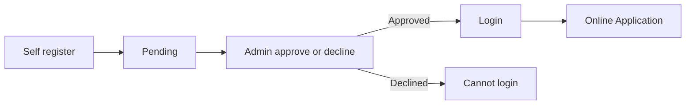
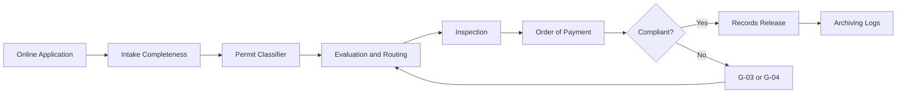

# Process Flows

## Account registration (before applying)

Emails: registration received (applicant + admin alert), approved, declined (with reason).

## End-to-end permitting (Phase I)

## Status timeline
Applicant account: Pending → Approved / Declined.  
Application: Draft → Submitted → Under Evaluation → For Inspection → For Payment → For Release → Released / Disapproved.
